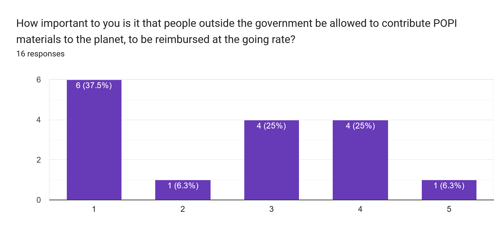

In August 2024, I conducted a survey of the citizens of Malahat. Here are their responses, plus a commentary from your governor. 😁

## POPI reimbursement

Five respondents said it was somewhat important people outside the government be able to contribute, while seven said it was not important. So it's somewhat split here.

More interesting is that only one person actually wanted to participate in the POPI system themselves. That respondent was an MP to was already contributing. I'm inclined to leave the program open, and just reach out if you'd like to contribute. The prices are on the ledger!

## Gateways

There's pretty strong interest in gateways, and for the use of Malahat funds to create a gateway. It's true we don't know a lot about how they will work. Right now, we know it will have a certain range in parsecs, so placing a gateway where it can save as many jumps as possible will be most beneficial. Gateways can be upgraded to increase the size of ships traveling through them, the range in parsecs, and the number of ships that can use it per day. We believe another gateway will be needed at the other side to link to. So we will likely need to collaborate with another planetary government once we know the ranges.

## Cash Buffer

Support for maintaining a cash buffer was quite high. About a month was the most common response.

And likewise the expectation is that the government should be paying for expenses as they are incurred. This is definitely what I am working towards with Malahat.

## Governor Salary

Support for a governor's salary was much higher than I expected. It can be a ton of work to govern a complex planet, but there's always been loud voices decrying spending. So this question is very valuable to me because I hear from a larger number of people, rather than just the few loudest voices.

I haven't taken a salary yet, but moving towards a cultural norm / standard / convention of a some sort of stipend is something I will continue to think about. For me, my income per hour played is probably fairly high, and valuing the time spent governing at the same rate probably doesn't make sense. So I asked for specifics and got these responses. I hadn't really considered a percentage as an option. Here are the responses for weekly goveror stipend:


* 1 mil per week. from taxes
* Idk
* 5% of tax income seems reasonable
* 10% of upkeep
* 5% upkeep
* Time is money, buy yourself something nice.
* especially now with expanded governments, I think it should be considered a public service more than a salary-driven position. larger corps could easily manipulate this as an unfair advantage
* 100k
* Amount that would cover consumables for his main planet. Like he is the governor and the rest of the peasants work for the upkeep of the governors manor-planet.
* 100K
* Not too much in order to not attract people to the position only because of the pay, but enough for the extra work that is running a planet. Maybe about 10% of what a 500 are base would make in a week.
* ~50k


## Taxation

I asked two related questions. What do you think the current tax rate is, and what do you think an acceptable rate would be? Generally I think there isn't a lot of understanding of what an individual's tax rates are or even what they are spent on. By educating the populace of Malahat, I hope to educate the entire galaxy.


| Current Rate                              | Column 2                                                                                                                                                        |
|---------------------------------------|----------|
| 5%                                    | 10%     |
| 5                                      | 1-10    |
| < 5%                                  | 5% max    |
| 3%                                    | Less than 5%    |
| 2-3%                                  | 3-4%    |
|                                        | Tax is theft. Idk lol o7 i trust you.    |
| don't know                             | 3%    |
| 3-4%?                                  | Balanced to Costs * |
| 12.70%                                 | 12.70%    |
| 10% of net profit                      | 15% of net profit    |
| 1                                      | 5    |
| maybe 40% (got a sponsored base)       | 16%    |
| 5%                                    | 5%    |
| 10%                                   | 5%, tops.    |
| a few percent                          | 5%    |

* full response: "It should be balanced to costs, which will also certainly rise in the future with things like gateways and other planetary projects. It's okay to tax low for now while it's the cheapest it will ever be, but I also believe in a buffer, and then balance the budget from there."



The actual tax rate for IDC is 3.08%. For EDC, it works out to 3.30%. For other products by lower tiers, the rate is even lower. If you are making SAL or SA in a Software Development lab, your tax comes to 35 AIC, which probably works out to around 0.44%. If you made DW on Malahat, your tax would be 0.2142 AIC per unit DW, for a tax rate of 0.23% at a DW price of 90. So anyone who isn't farming EDC/IDC is certainly paying a much lower percentage.

Generally people figured their tax rate was around 5%, but there was a lot of variation. Most people answered that they would be okay with a higher tax rate, but answers were all over the place. If you want to see what your actual tax rate is, the game tells you your actual tax per production order here:

You can divide out the CX cost to get the percentage.

## Recommendations

Nearly everyone recommends Malahat!

And generally, people strongly prefer having all their workers, rather than saving on their taxes and missing workers. 

## Currency

I asked about currency just as a future reference point. AIC was the most popular currency respondents chose, with NCC and CIS tying for second place. Devs expected to one day allow us to change our currency, but there's no telling when that will happen. I am very conscious of the potentially disruptive effect that changing currencies might have. 

