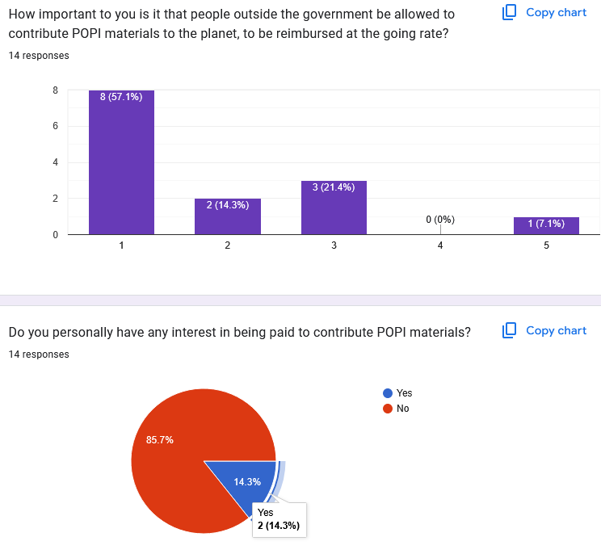
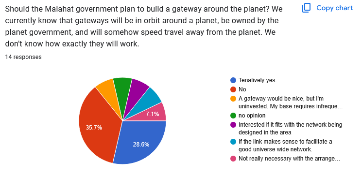
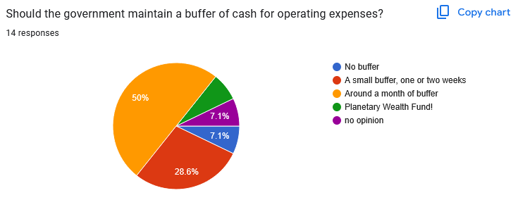
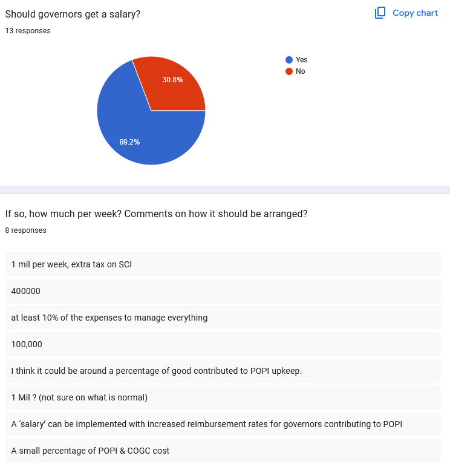
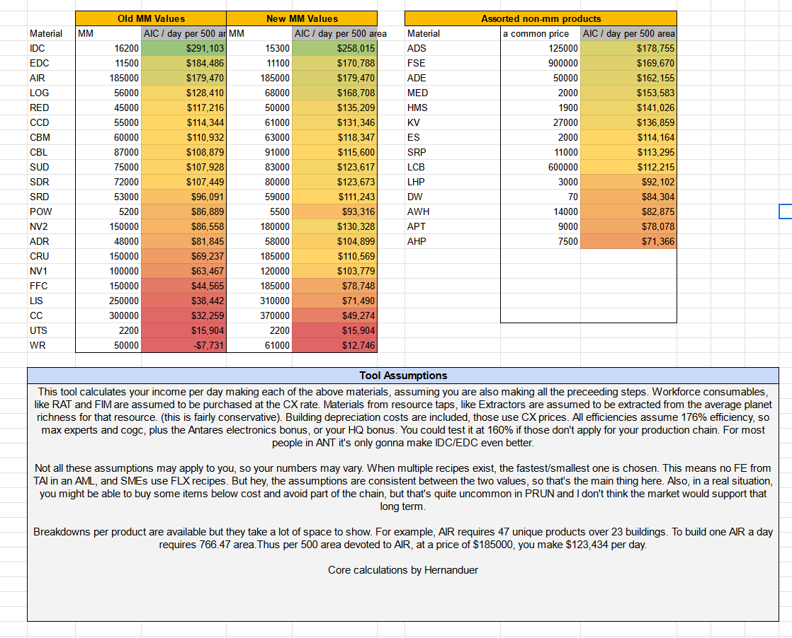
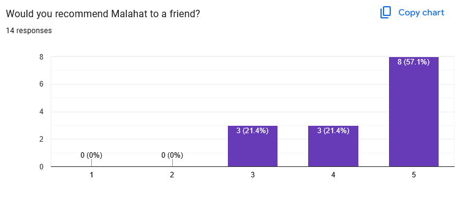
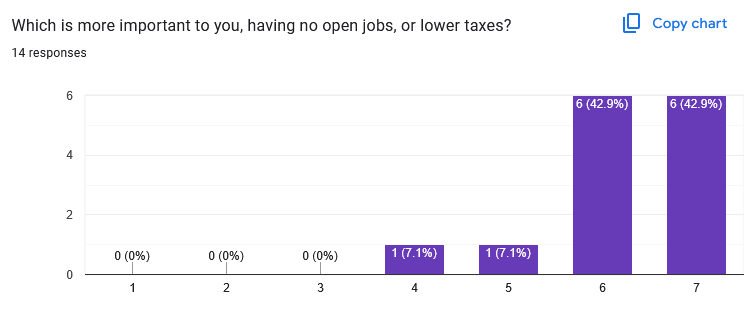
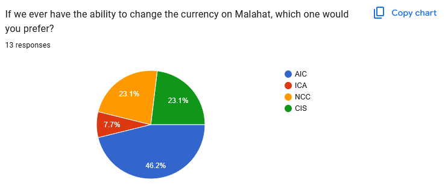
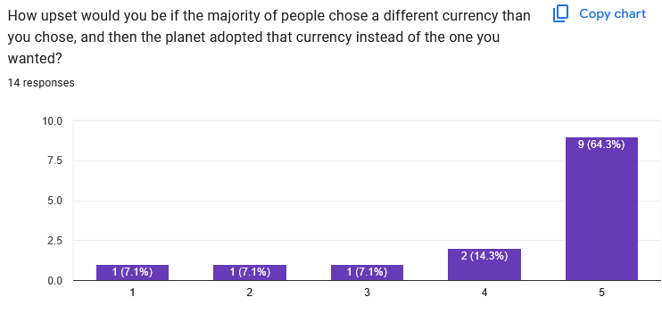

In late February of 2025, I conducted another survey of the citizens of Malahat. Here are their responses, plus a commentary from your governor. I kept the questions the same as the [2024 Malahat Survey](/posts/2024-malahat-survey).

## POPI reimbursement

This year, there is increased interest in outside people contributing to the POPI. Two out of 14 respondents have personally expressed interest (double from last year).

I'm enthusiastic to see more interest here! I remain open to more contributors. If you're interested, please reach out. The reimbursement prices are on the ledger. In short, if you bring regularly contributed items to Malahat, I will buy them from you and reimburse myself after I supply them to the POPI. This is logistically easier than tracking items purchased by the government, but not yet put into POPI.

## Gateways

Support for gateway projects remains fairly similar to last year's survey, with just over 50% feeling supportive of the idea. Current galaxy-wide plans don't include a gateway to Malahat itself, and I think the responses show an understanding of that. Since the original survey, I've been leading the [Antares Development Initiative Gateway Cooperative](/ADI-gateway-cooperative/) entirely independently from my governance work. 

I think there may be opportunities for Malahat and other large planets to play a role in regional development, but that's a larger topic for a later time.

## Cash Buffer

Similar to last year, the most common response suggests a buffer of around a month of operating expenses.

## Governor Salary

As with last year, support for a governor salary remains quite high. I still haven't taken a salary yet for the same reasons as last year, but I think it would be great to see attitudes in Prosperous Universe shift to compensate governors of large planets for the time and shipping spent managing the planet upkeep.

## Taxation

I asked respondents what they thought the current tax rate was and what an acceptable rate would be. Generally, there seems to be improved awareness, with a few guesses at 10% and a few guesses in the 2% to 1% range.

Since last year, we had a tax reduction on Malahat. Last year, the actual tax rate for IDC is 3.08%. For EDC, it worked out to 3.30%.

This year, IDC is taxed at 2.48% and EDC is taxed at 2.43%. We achieved these savings by carefully maintaining steady and cost effective growth. 

Tax cuts for products on lower tiers were even more significafnt. If you are making SAL or SA in a Software Development lab, your tax used to come to 35 AIC, which roughly works out to around 0.44%. After the tax cuts a few months ago, it dropped to 15 AIC, giving a tax rate of 0.18%... well under one percent!

After the September 2024 market maker balance change, IDC and EDC have become slightly less profitable. However, IDC is still far-and-away the best MM you can produce from a base-area-day perspective. It's the most AIC per unit area, given the whole chain. It also tends to beat out just about everything you can normally produce and reliably sell. Other contenders like AIR and LOG have drastically more complex chains, but do approach the profitability of EDC. 

Note that the right column prices are older market prices, you can mentally adjust them as you consider the balance. 

There's an eternal discussion about the role of IDC farming in inflation and money supply, and if it's a good mechanic. Taxation has the ability to pull down the relative efficacy of IDC. But 2% tax rates don't shift the math at all, and there is yet no consensus on mitigating IDC farming with taxes. 

## Recommendations

Nearly everyone continues to recommend Malahat!

## Open Jobs vs. Lower Taxes

As I'd personally expect, people strongly favor having no open jobs over quibbling about fractions of the 2.48% tax rate.

(1 - Lower taxes are more important, 6 - No open jobs is more important)

## Currency

AIC remains the preferred currency, with 46% support. I asked about currency just as a future reference point. AIC was the most popular currency respondents chose, with NCC and CIS tying for second place. Devs expected to one day allow us to change our currency, but there's no telling when that will happen. I am very conscious of the potentially disruptive effect that changing currencies might have. 

In fact 64.3% of respondents indicate that they will be _maximum angry_ if a different currency than their favorite is adopted. More people will be angry about the currency choice than preferred any given currency. This illustrates an important fact of governing- no matter what you do, a lot of people will be angry.

## Anonymous Testimonials

* _Malahat is the smoothest run planet I've been to. I should have come here a long time ago_
* _You're doing a great job as governor_
