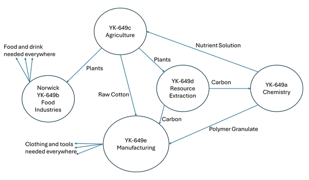
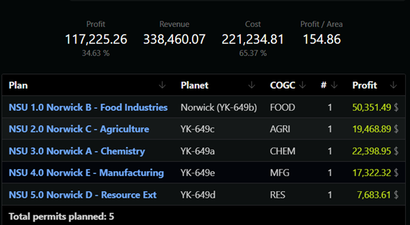
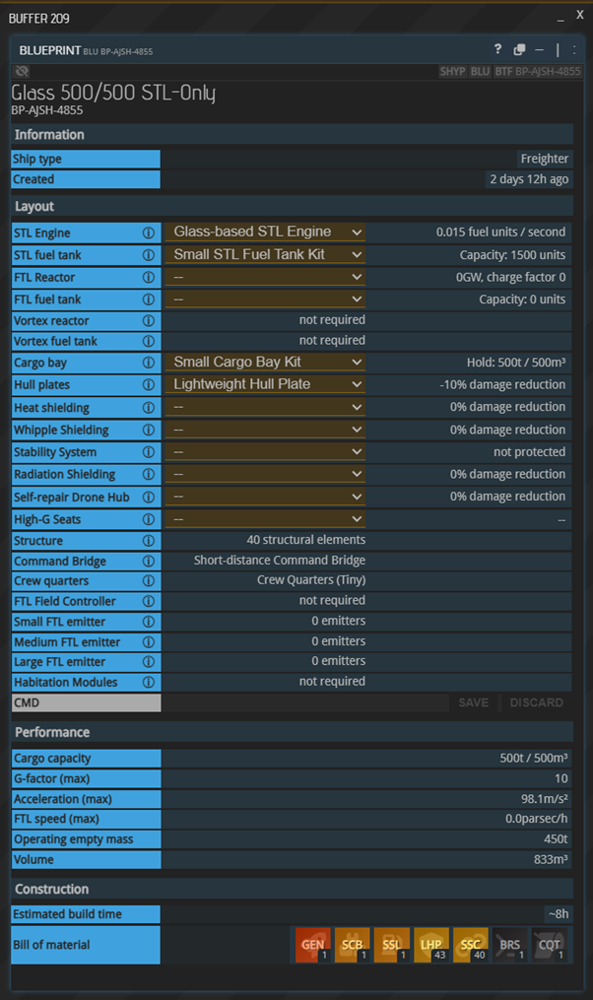


# **Norwick STL University**

#### **Quicksolv | AGSI** 

#### **Partners: \[OOG\] BlueOrange | TMI; \[OOG\] Fremen45 | HI**


**Vision:** Mentorship program for new players to teach the ins and outs of the game to make them successful. Long-term goal is to have a growing, sustained player base in the system, while increasing PIO/SET consumable supply. 

**Description:** NSU is a crawl-walk-run program to teach a player base design, vertical integration, logistics planning, and asset management. Going through the entire program will see a player walk away with five bases and a glass-engine STL ship. Each base design was built by myself (Quicksolv | AGSI) and BlueOrange | TMI. The design for each base followed six constraints:

**Base Design Constraints**

1. Builds PIO/SET consumables or vertically integrates production  
2. Creates excess of each good for profit  
3. Costs less than 1,000,000 AIC  
4. Daily expenses is under 100,000 AIC  
5. 500t/500m3 Starter ship can import 3 days worth of production and workforce consumables and export 3 days worth of production outputs    
6. Matches the COGC

However, a player going through the university does not have to utilize these designs. If a player wants to maximize profitability or run a hub-and-spoke logistics model that does not vertically integrate it is acceptable as long as the plans turn a profit and make sense for the player’s goals.

## Quicksolv’s Suggested Path and Plans 

**Costs / Profit (as of 17 Jan 2026)**

| Planet | COGC | Construction Cost | Daily Cost | Daily Profit |
|-------|------|-------------------|------------|--------------|
| [Norwick (YK-649b)](https://prunplanner.org/shared/c0e4f408-0ec8-4b58-a814-eb4200e39f83) | Food Industries | 582K AIC | 80.5K AIC | 50K AIC |
| [YK-649c](https://prunplanner.org/shared/1dc234c9-db99-45e0-884a-292483e70d4d) | Agriculture | 1.02M AIC | 46K AIC | 19.5K AIC |
| [YK-649a](https://prunplanner.org/shared/cbdfe4f7-6233-49f3-a4d0-4266d52100ae) | Chemistry | 882K AIC | 32K AIC | 22.4K AIC |
| [YK-649e](https://prunplanner.org/shared/0a1258d9-a16c-4f8a-b638-96e7a5b03c73) | Manufacturing | 860K AIC | 43K AIC | 17.3K AIC |
| [YK-649d](https://prunplanner.org/shared/74735ece-0c51-4530-8ac5-9bc6915686ca) | Resource Extraction | 493K AIC | 8K AIC | 7.7K AIC |

The construction cost of all five starter bases is \~3.8M AIC. Screenshots are included below from the PRUNPlanner Empire. This shows the daily cost, profit, and consumable production for both PIO and SET consumables. This does not include production information on all of the intermediate goods, everything produces excess that can additionally be sold for profit. Players should seek to acquire an STL-ship after establishing 3/5 bases.

The most significant imports will be H2O and SF which do create logistical challenges for players. We’re planning to reduce external H2O needs with our own imports.Efforts to reduce import burden on SF are ongoing.

## Logistics Flows

## Build Sequence (In series)

Building the planets one at a time has two main advantages: it allows the player to build up as funds become available, and it gives the flexibility to make a partial commitment.  If you’re not sure about making a 5-base commitment to producing workforce consumables, the sequence in this section allows you to stop at any point in the series while still having a worthwhile business.

Norwick is the best choice for the first planet in the system.  It is a triple-green planet, which means that no environment materials are required to build there.  Inputs can be sourced easily from Harmonia (either from vertical integration or the local market) and the market for Food Industries products is consistently strong and reliable.

The second planet should typically be YK-649c, the Agriculture planet.  This planet consumes food products from Norwick, and provides inputs to Norwick’s production.

When choosing which planet to do third, pay attention to market conditions.  If you’re not satisfied with the profits you’re making from selling agriculture outputs, then build YK-649d (Resource Extraction) to turn the plants into carbon.  (At the time of writing, carbon prices in Antares are consistently high.  When you read this guide, check carbon prices: it’s possible that carbon production has increased as a result of people following this guide, driving prices down.)

If the carbon price is low, or the price of nutrient solution is high, then YK-649a (chemistry) might be a better choice.  The intention with YK-649a is to consume carbon and turn it into polymer granulate, while also consuming imports and turning them into nutrient solution.  Consider the reality of your situation.

Since there’s a relationship between carbon production on YK-649d and carbon consumption on YK-649a, it makes sense to follow one with the other.

Manufacturing on YK-649e would normally go last.  It consumes PG from YK-649a, carbon from YK-649d, and various imports to make the consumables required by all the other bases in the system.  But maybe you feel confident in your ability to source the materials and to market them to other players in the YK-649 system without hauling them back to Antares, in which case you might build the manufacturing base earlier.  (If you’re not consuming yourself in-system or selling for local pickup, you’ll be better served with a manufacturing base closer to Antares Station.)

## Build Sequence (Parallel)

Another option is to start by building all five bases at once, and to then continue building them up in parallel.  This gives a very logistically efficient empire from day one, but does require over four million AIC in available capital (to cover the construction cost, consumables, inventory, and HQ upgrades). There are two main ways for new players to achieve that level of capital strength: one is to borrow from the banks, the other is to collaborate with other players. For players looking for a highly collaborative experience, dividing the bases between participants and balancing the logistics would be excellent practice for more complex collaborations aimed at producing high-tier manufactured products.

In this case, it might make sense to start with YK-649c, since it has the simplest input requirements, and then proceed to Norwick and YK-649d (these planets consume inputs from YK-649c).  Then proceed to the somewhat more complex input requirements of YK-649a.  YK-649e goes last, because it consumes inputs from all the other planets except YK-649c, sends supplies to all the other planets, and also requires a significant list of imports from outside the system.

# Appendix A: Financial and logistical reports



FIGURE 1: NSU Empire Overview

FIGURE 2: PIO Consumable Production  

FIGURE 3: SET Consumable Production


# Appendix B: Glass Engine STL Blueprint





# NSU Contributions and Milestones:

\[ 20260112 \] 2.8M AIC from Phobos Parliament for YK-649c ADM, COGC, WAR, POPI  
\[ 20260115 \] 10,000 H2O from Zipatsu  
\[ 20260116 \] YK-649c Settled {Quicksolv}  
\[ 20260117 \] 3M AIC from Phobos Parliament for YK-649a ADM, COGC, WAR, POPI  
\[ 20260118 \] YK-649a Settled {BlueOrange}