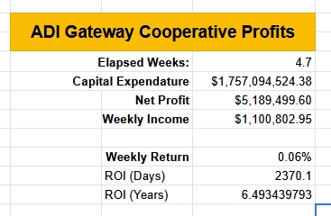
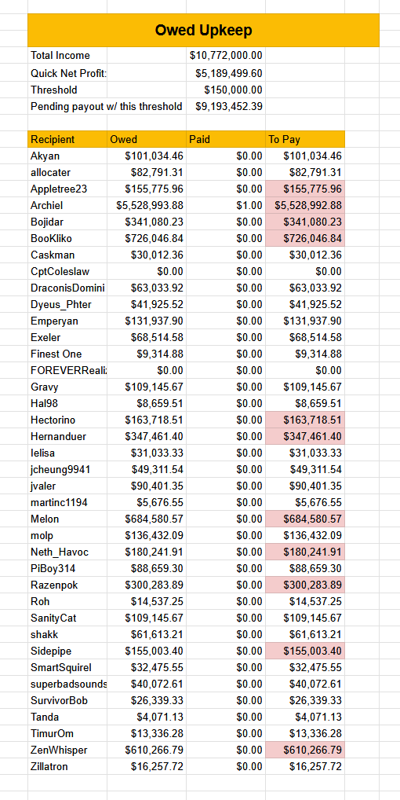
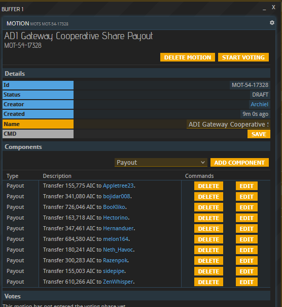

The ADI Gateway Cooperative is an Antares-based regional group focused on constructing gateways. By contributing resources to the gateways, members earn ownership shares proportional to their contributions. By banding together, [co-op members ensure the smooth operation of gateways](/adi-gateway-cooperative/) in Antares and beyond!

# Gateway Update

Sixty days after the completion of the first gateway, and the [Gateway Maintenence Release](https://com.prosperousuniverse.com/t/release-notes-maintenance-2026-01) improving the fueling and upkeep system, we are beginning to see the fruits of years of labor by nearly 40 AGC contributors.

The current gateway status:

* Heph -> Griffonstone: Fully complete!
* Griff -> Heph: Fully complete!
* Heph -> IA-158b: Linked with support for 2k ships.
* IA-158b -> Heph: Linked with support for 2k ships.
* Griff -> Etherwind: Gate complete, upgrades in progress
* IA-158b -> Promitor: production in progress

# Gateway Income and Expenses:

Our in-progress gateway network has earned 10.7m in the past 5 weeks. Of that 5.58m was spent on upkeep and fuel- fortunately these are somewhat front-loaded so our average weekly costs will tend down as these filled buffers are averaged over a longer time period. Additionally, the full upgrade cost is borne even for gates that were just spun up. So actual profits should improve over the following weeks.

I'd like to thank ADI member Bookliko for stepping up on the fueling contracts. These contracts pay 1 AIC up front, but get reimbursed with other payouts. Archiel is handling upkeep at the moment, but if you're interested in taking over, please contact him.

Gateway earnings are split among the 3 planets:

With 5.58m in upkeep and fuel to pay out, the net earnings stand at 5.189m. Individual accounts above a certain threshold (determined by my patience for sending contracts), will recieve a payment and their account will be debited by that value. Next week, the next highest group of players will recieve a payment, etc. Current balances stand at:

All income is logged with screenshots on the ADI gateway sheet.

Skipping Archiel, who will be paid from Heph, this puts the first payment as:

# Gate Traffic and Future Profits

The returns on the project depend on the usage of the gates, and the speed through gates of various ships is certainly [under discussion](https://com.prosperousuniverse.com/t/poor-gateway-flight-times/7332/25). We are keenly aware that changes to the default behavior of "always take the gate" may detrimentally affect our income. On the other hand, as more gates come online, use of gates becomes faster, making them more valuable to our customers.

## Join the efforts



