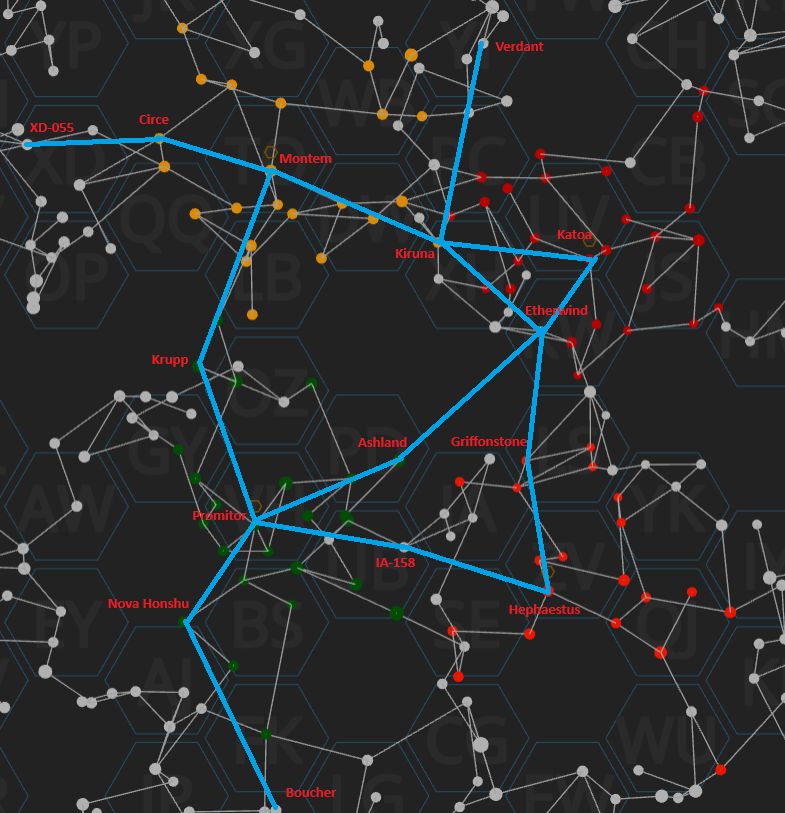

The ADI Gateway Cooperative is an Antares-based regional group focused on constructing gateways. By contributing resources to the gateways, members earn ownership shares proportional to their contributions. By banding together, [co-op members ensure the smooth operation of gateways](/adi-gateway-cooperative/) in Antares and beyond!

# Construction Progress



* Heph to Griff:
  * Gate Construction Complete
  * Range Upgrade Complete
  * Volume upgrade in progress
* Griff to Heph:
  * Gate Construction Complete
  * Range Upgrade Complete
  * Volume upgrade in progress

Right now, the first pair of gates is linked and accepting traffic under 1500m3. 




## What's still needed?

You can still help out! If you have ASMs on Vulcan or Deimos, you can help refine RE-based alloys for a stipend that covers your costs. Contact Archiel with your ASM count on each planet. 

Additionally, we're still looking for more GWS. If it's too much to make a whole GWS, you can contribute just some subcomponents.
* PFG production mostly requires ECA products, and requires no Rhenium.
* SDM production is mostly TRS, made in PP4s. 
* TRS is also still needed!


# Gateway Network:

This is realbandit's summary image of the gates planned by all gate building organizations. For more information, see the new gateway channels in the UFO discord.

## Join the efforts



