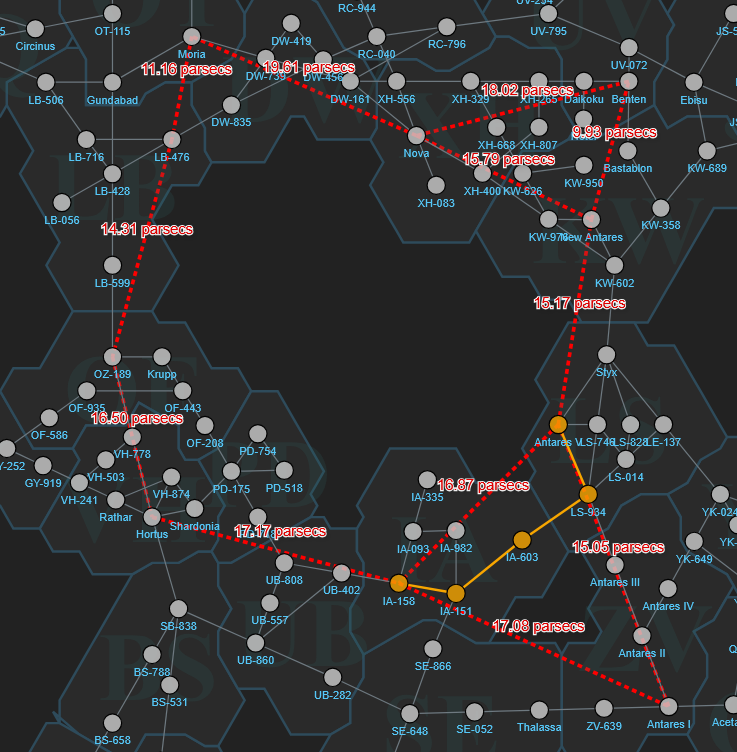
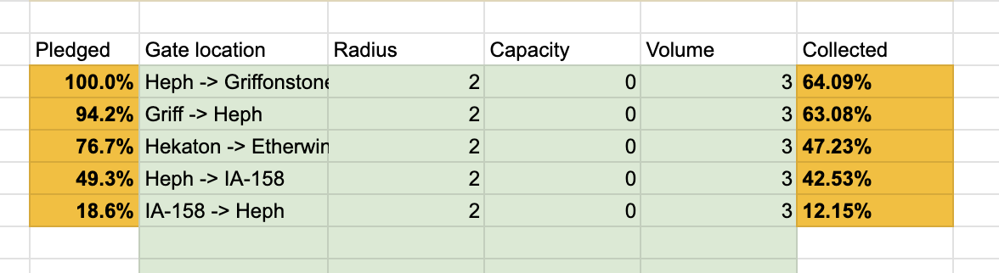

The ADI Gateway Cooperative is an Antares-based regional group focused on constructing gateways. By contributing resources to the gateways, members earn ownership shares proportional to their contributions. By banding together, [co-op members ensure the smooth operation of gateways](/adi-gateway-cooperative/) in Antares and beyond!

# What's New:

After significant discussion with shareholders in the ADI Gateway Cooperative channel, we've made the decision to shift some gateways around in order to support 5k/5k ships.

* Added Capacity 3 upgrades to support 5k ships and swapped Hekaton for Griff. The griff gate now leads to etherwind in New Antares.
  * This increases requirements for rfabs quite a bit, but lowers other items, putting us into a surplus on some items.
  * For this reason, I am planning to add the IA-158 -> Heph return gate, and leaving the IA-158 to Hortus gate for EvoV.
  
These changes mean we need more materials for the expanded network! Your contributions are welcome and [result in shares of the cooperative](/adi-gateway-cooperative/)!

# Current Gateway Network:

These changes result in a central loop like this:

Of these gates, The ADI Gateway Cooperative is building the following:

BEN Gateway planning is being lead by CptColeslaw, and organized on [this sheet](https://docs.google.com/spreadsheets/d/15ho6zu_fic6sz5avIv1_O1sLVHjDpRGbbkZEgb8152s/edit?gid=65369777#gid=65369777).

MOR region gates are being organized by realbandit of Supernova Foundries.

EvoV is constructing and running the gate from IA-158 to HRT.

The extra links (IA-158 to Antares V and New Antares to Nova) will be added last, if demand necessitates them.

## Join the efforts



