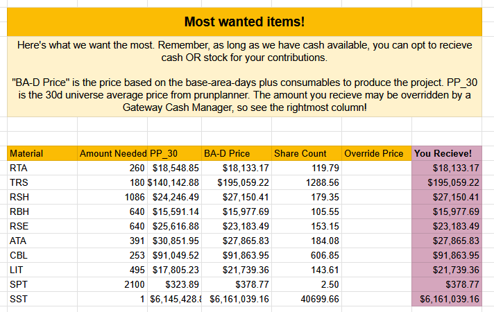

The ADI Gateway Cooperative is an Antares-based regional group focused on constructing gateways. By contributing resources to the gateways, members earn ownership shares proportional to their contributions. By banding together, [co-op members ensure the smooth operation of gateways](/adi-gateway-cooperative/) in Antares and beyond!

# March 2025 Progress Update

## Collecting Materials:

Pledge collections have begun, and we have solid contributions coming in across the materials. Right now, 52% of our pledges are filled, and if you don't count the unreleased materials, the number is just under 70%. 

## What's still needed?

Your help is still needed- I'd love to see more people throughout the galaxy contributing to the project. Check the Gateway Ledger for an up to date list of most wanted items. As of the time of this writing we need:

We recently had some people who made pledges leave the game, so new pledges have opened, especially in Rfabs and RSH. Once we get closer to the gateway launch date, I will reach out again to people with unfilled pledges and will expire any that are likely to remain unfilled.

## Cash Contributions:

$256,100,000 has been contributed to the project, and 98.94% of that has been spent and shipped to the ANT warehouse. 

Managing cash contributions dilligently has been a lot of effort, but through careful bids on every CX, I have recieved a great return on these cash contributions. They have been focused on hard-to-get materials, and we've had good returns buying in a few key areas: RSH/TSH, SP, and afabs. Monitor the responsible spending of cash contributions on the [Cash Contribution Register](https://docs.google.com/spreadsheets/d/1oET7LURFw6m-3iKu_5n8iT2SWS4PU-P-hiH6fMazWmU/edit?gid=73270455#gid=73270455).

## Join the efforts



