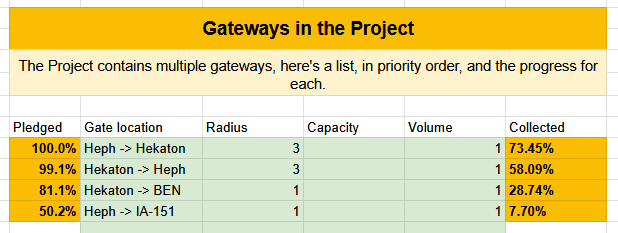

The ADI Gateway Cooperative is an Antares-based regional group focused on constructing gateways. By contributing resources to the gateways, members earn ownership shares proportional to their contributions. By banding together, [co-op members ensure the smooth operation of gateways](/adi-gateway-cooperative/) in Antares and beyond!

# March 2025 Progress Update

## Collecting Materials:

Now that we have some complete gateways, I will begin contacting people to collect their pledges. We've demonstrated we've got resources to complete gates, so collecting and positioning resources now will prepare us for the release. To help me out, please send me your materials before I have to ask. 😄

I will focus on collecting the Heph and Hekaton pair first. 

Collecting materials now also helps lock in your shares, and mitigates risks associated with people forgetting about pledges made months ago.

## Cash Contributions:

So far $127,785,359 of $180,000,000 recieved contributions has been spent towards the project. Lately we've been very successful in acquiring the tough-to-get items like SP via the CX. I've noticed a few people have spun up bases just to sell into the Gateway coop buy orders. We've been able to keep the shares purchased through this program competitive with the material rates. 

More cash contributions are welcome! It's a great way to turn idle cash into economic value for the region!

## Galactic Gateway Coordination

We're coordinating our efforts with other groups. A group in BEN is planning the return gate from BEN to Hekaton. EvoV is planning the return gate from IA-151 to Heph. This works great from an ownership point of view, since it consolidates the coop's gates on Heph and Hekaton, where the accounting will be easy to manage.

As before, these gateways are planned:

## Join the efforts



