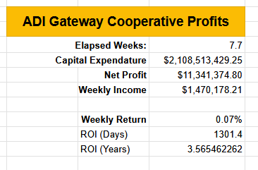
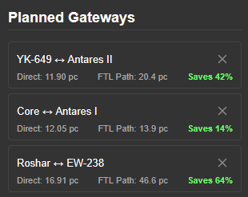

The ADI Gateway Cooperative is an Antares-based regional group focused on constructing gateways. By contributing resources to the gateways, members earn ownership shares proportional to their contributions. By banding together, [co-op members ensure the smooth operation of gateways](/adi-gateway-cooperative/) in Antares and beyond!

# Phase 1 Complete!

I'm thrilled to announce the initial phase of five fully upgraded gates capable of supporting 5k ships has been completed in Antares space. Not only are we the only region with 5k ship support, but all our gates support the largest ships. The upgrade for 5k ships apprixmately doubles the number of GWS needed for a gate, so it's a sizable expense.

Financially, the situation continues to slowly improve. With 11m in profits, the ROI has gone from 6.5 years to 3.5 years. As more gates come online, traffic on the system has increased. Longer uptime also improves the traffic-to-upkeep ratio, since upkeep is still a major portion of our income. 

# New Gateway Tool

Our new [Gateway Fuel and Upkeep Monitor](https://oogcapitalmanagement.com/gateway-fuel-monitor/) tool provides a quick look at the status of all the new gates!

# Understanding Gateway Mechanics

The AGC's open nature results a lot of great discussion and ideas. Unfortunately, the gateway mechanics are complicated and it can be tough for everyone in a conversation to fully internalize all the gateway mechanics. When pondering gateway placement, here are a few things to consider.

### Traffic numbers are vital

It's easy to want to imagine a gateway to your particular niche system, because it will be helpful to you. You might even know a few friends on that planet. However, a pair of gates costs 300k in upkeep a week. That means you really want 100 trips a week through that gate. Even if you've got a co-op somewhere with 20 people (which would feel like a very large co-op!), you're probably only 1/3rd the way to a viable gate.

It's better to look at workforce population numbers, 100k population on a planet might be a reasonable starting point.

### The value of your gate is in parsecs saved

You want your proposed gate to reduce the effective distance between points significantly. Flying from Roshar to EW-238 via FTL drive is a total of 46.6 parsecs over 7 jumps. A gate directly there is 16.91 parsecs. The gateway moves you at 3 parsecs per hour- your FTL drive will actually be a bit faster on most ships. So without a significant savings, your gate will be slower.

A < 20% savings is not worth considering.

Also, if you're starting in-system, but not in-planet, the FTL savings needs to outweigh the STL flight time of getting to the gate. 

The gateway makes sense if:

$$d_{\text{FTL}} \cdot v_{\text{FTL}} > d_{\text{gateway}} \cdot v_{\text{gateway}} + t_{\text{STL}}$$

$t_{\text{STL}}$ is typically 2-4 hours. Your $v_{\text{gateway}}$ will be 3 parsecs/hr, and your $v_{\text{FTL}}$ will be slightly higher, 3.5 to 4.5.

---

### FTL flights to gates sidestep the STL flight times

If your gateway flight begins with an STL flight from a CX to a gate, or from a planet to a gate in orbit of a different planet, you are going to have a long STL segment. With the way the ship flight computer allocates a default amount of SF, your STL flights might be even longer than usual. This is why you sometimes see gate trips take longer than FTL flights.

Instead, put your gate in an adjacent system, and your ship will FTL directly to it.

---

### Compromising the effectiveness of the gate with compromises.

When people see a gateway map, they _really really really_ want all the gates to connect, just like a subway map. Many people will cheerfully make a bad design so just so lines can connect. Gateways don't operate like subways, think of them more like a link in a multi-modal transportation system. 

It's okay that your UPS package flies on an airplane to your city, then takes a truck to your house. Demanding that every package stays on an airplane network reduces the effectiveness of the system. Our PRUN ships struggle (relatively) with STL flight, in just the same way airplanes would struggle navigating to your house. Allowing for your "last mile" to happen via your ship's FTL drive reduces the role of the weak link of STL flight in the system.

A few other items:
* Since we only get 5 upgrades, support for 5k ships means reducing the max gateway range from 25pc to 20pc.
  * Due to the randomish placement of systems, this reduces the % distance saved for a gate, on average.
* STL ship support
  * Support for STL ships sounds neat, and the natural desire is to compromise on design to add this feature. More features yields more support from special interests but results in a less focused and less effective product. 
  * By fretting less about STL support on future networks, we can improve our placement choices.
* Closer to the CX is more important than "Oh I have a base on that farther out planet"

And on the positive side:

* Planet to planet gates are quite strong
  * A CX can't have a gate, but if you are going between two planets that have gates in orbit, you're doing great!
  * But if you're elsewhere in system, the STL cost is high and you're better avoiding the gate.
  * Few people do planet-to-planet shipping, they do hub and spoke
  * Both planets need a large population, and a strong reason to fly between planets directly for this to make sense.

---

### Shareholder Planning

Due to the open nature of AGC, many non-contributing shareholders had a lot of weight in the discussion. Since they're "spending other people's money", they don't have the same motivations as shareholders. Now, each gate added to the AGC could either dilute or strengthen our shareholder's positions. For that reason, there will be share-holder specific channels.

Additionally, any voting that may be needed will be ranked choice, rather than winner-takes-all.

---

## Possible Additional Gates

## Join the efforts



