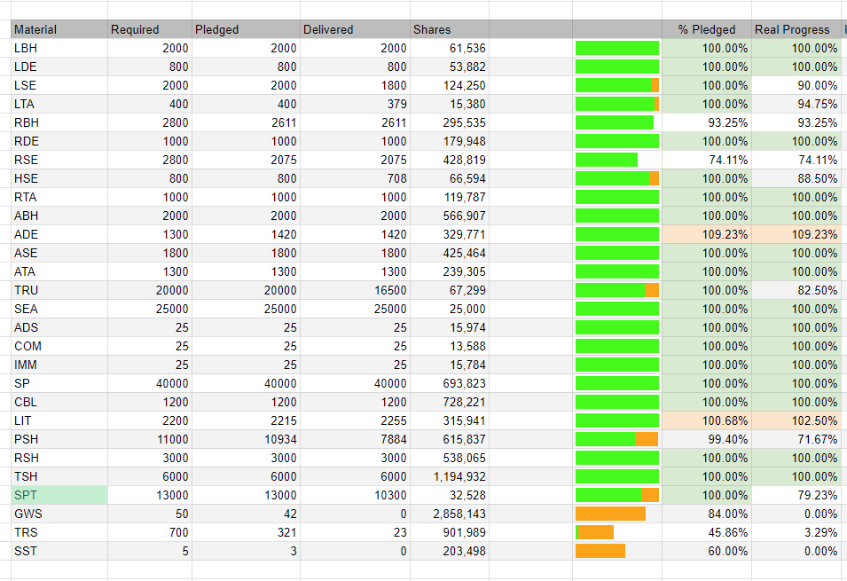
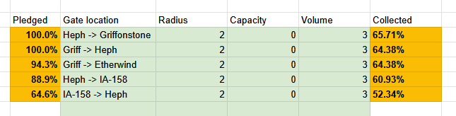

The ADI Gateway Cooperative is an Antares-based regional group focused on constructing gateways. By contributing resources to the gateways, members earn ownership shares proportional to their contributions. By banding together, [co-op members ensure the smooth operation of gateways](/adi-gateway-cooperative/) in Antares and beyond!

# Gateway Update

The [Gateway Release](https://prosperousuniverse.com/blog/2025/11/17/10-years-of-prosperous-universe-507) is coming November 26th, 2025!

Material collection continues, but most of the effort right now is focused towards production of GWS, TRS, SST, and those key precursors. Rhenium production is underway, and the big blockers are expected to be the RE alloys and TRS production. See below for more information on materials.

# About the Cooperative:

With release approaching, let's refresh everyone on the [rules of the cooperative](/adi-gateway-cooperative/). 



* Anyone in ANT who wants to join the co-op is welcome.
* We track the contributions, and each contributing member has a percentage of the entire gateway project assigned to them. Thus you become a partial shareholder of the project.
* The co-op maintains a sheet tracking contributed materials, and also "planned materials"- materials intended to be contributed, in an effort to avoid accidentally making too many of a particular gateway material.
* Gateway income (from transit fees), are distributed propotionally according to shares.
* All members agree to elect members of the co-op for the government of the gateway planet. They may pick a candidate of their own choice from the co-op, as long as it ensures a co-op member wins.
* Any member elected to a gateway planet agree to facilitate (personally or through a representative) the operation and fueling of the gateway, and the distribute gateway profits according to these rules.



This ensures the ownership, control, and profits of our gateways stays within the cooperative. The investment of the members is protected, and the gateways are intended to generate a return for the members. Fees for the gateways will be value based, and rebalanced based on ridership (flyership?).

## Stepped up for release:

We still have some pledges that are unfilled. As launch approaches, people with materials-in-hand will begin to take priority over unfilled pledges.

## What's still needed?

Your help is still needed- RSE and RBH are needed. 

For new materials:

* HSE and PSH are needed for TRS production. 
* We need a total of 50 GWS, each GWS needs:
  * 1000 SPT, 4 TRS, 1 SST, 2 TOR (which is 400 ALR)
  * Each SST requires 10 TRS, 1 PFG, and 200 WHR.

These GWS subcomponents are not separately collected in the sheet, so if you are interested in producing these for a GWS producer, contract Archiel.

I'd love to see more people throughout the galaxy contributing to the project. Check the Gateway Ledger for an up to date list of most wanted items. As of the time of this writing we need:

# Gateway Network:

Of these gates, The ADI Gateway Cooperative is building the following:

# Governmental Responsibilities:

We plan to have an Coop member as an MP on each planet with an ADI Gateway. That member can watch for and record gateway fees, manage the motions to create, upgrade, fuel, and upkeep the gateways. (It's a lot of motions). 

We have a fiduciary obligation to return fees to the contributors of the project. Unfortunately, the funds are intermingled, so care is needed recording 

## Join the efforts



