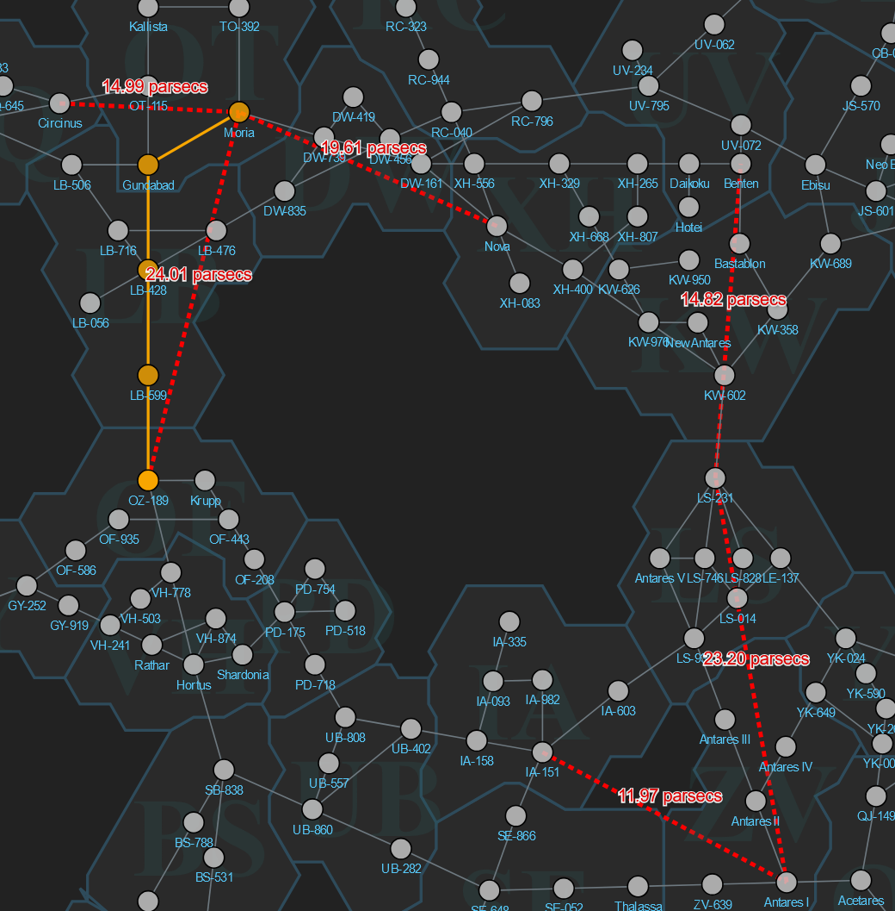

The ADI Gateway Cooperative is an Antares-based regional group focused on constructing gateways. By contributing resources to the gateways, members earn ownership shares proportional to their contributions. By banding together, [co-op members ensure the smooth operation of gateways](adi-gateway-cooperative/) in Antares and beyond!

# December 2024 Progress Update

We now have 85.91% of the materials for the first pair of gateways pledged. We anticipate it'll still be a few months before release of the gateways, so be sure to update your pledges as you continue to produce gateway materials. I expect to add our third gateway to the list soon, which will bump up the resources needed, allowing for more contributions.

We are coordinating with other gateway groups in the universe, and here's a list of all known planned gateways:

Thanks to our members who have named the system LS-231 as "Styx" and the planet for our gateway "Hekaton". Hekaton is derived from the greek: Hekatompylos, the city of one thousand gates.

## Cash Contributions

Thanks to to very generous financial contributions by Bojidar, Sidepipe, and Akyan, we now have 130m received to buy key materials for the project. If you have these materials and are willing to sell at this price, please contact me:

### Remaining Materials

* ~~100 LIT @ 19k~~
* ~~100 CBL @ 91k~~
* ~~150~~ 50 ASE @ 36k
* 300 ABH @ 43k
* 800 RSH @ 26k
* 5000 SP @ 2600
* 200 PSH @ 8000
* 400 HSE @ 11,500

(I will not be live-updating this. See the ADI sheet for up to date values.)

# The next gateway

In cooperation with our friends in BEN, the ADI Gateway Co-op will be responsible for the gate from Hekaton to BEN, and they will be responsible for the return gate. SilentReaper / eminence are taking the lead on that side.

Our gateway spreadsheet will be updated soon with the extra materials. 

## Join the efforts



## Antares Gateway Planning

The Antares Development Initiative is organizing gateway planning in the best region of space in the universe. It's important to consider both sides of a gateway in planning, the reusability of a gateway as a destination for multiple gateways, and the cost per jump saved, given the upgrades chosen.

