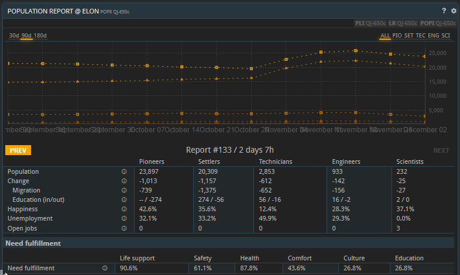
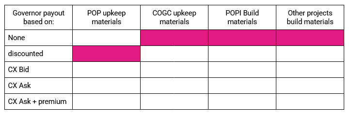
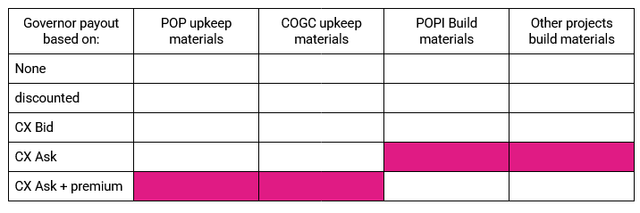
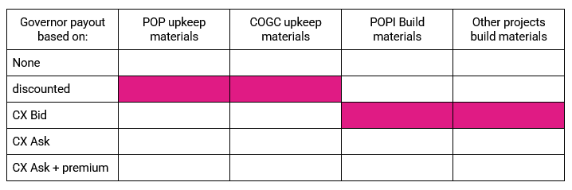

This guide has been brought to you by [/](OOG) - We are the premier corporation in Antares space and leaders in production, ship design, and galactic strategy.

# Responsibilities of a Governor
Generally the responsibilities of a newly elected governor falls into these categories, roughly in order of importance:

* Maintain the COGC
* Maintain the population via population infrastructure and government programs.
* Upgrade other infrastructure
* Ensure sustainable finances

We assume at this point, you're fairly familiar with the basics of Prosperous Universe. Before trying your hand at governance, you probably should have a few bases and have looked around to see what is behind the “Planetary Administration Center”, “Local Rules”, and other screens on a planet buffer. Be aware that governing a low population planet can require some upfront investment from the governor before being able to build up a financial buffer for investments. Income may ramp up slowly for new planets and is primarily dependent on tax income from working population. It will also help if you understand how a COGC works.
A governor is never alone as the parliament has MP's that can support you with advice, materials or even take over in case real life takes priority. The UFO discord channel is also full of players ready to assist in any way: https://discord.gg/Ywm2kGRH 

## Archiel's Governor Helper spreadsheet
Make a copy of this sheet, and enter the name of your planet in the green box in the top left.

[Archiel's Governor Helper](https://docs.google.com/spreadsheets/d/19mg6DKaGi_cfjLNyb8AeS00oddgMbepTDf9RIkOMocw/edit#gid=0)

Wait while the sheet pulls the data from FIO for your planet and populates the sheet. If it doesn't load after a bit, try again later by changing the planet name and changing back. For most reliable results, use the natural ID of the planet (for example ZV-896b instead of Harmonia).
Each section of the sheet has an explanation, and as you read this guide, you'll understand each section a bit more. You'll mainly interact with the bottom section, that calculates how much need is supplied with each consumable. 
Check the boxes for each consumable you want to provide, paying attention to the $/satisfaction of that consumable. It will then calculate the projected True Happiness for those supply levels. (Recall the happiness shown in-game is averaged over 5 weeks). 
The top right section will provide a prediction on the population growth resulting from the happiness percentages, where you can also evaluate if running projects is worthwhile (more on those later).



## Chamber of Global Commerce

Each 10 days  a planet requires a mix of 4 basic materials (DW, MCG, PE, and RAT) in order to maintain the 25% bonus to production provided by the COGC. The actual amount required for your planet varies on the number of players on the planet. While any player can donate to the COGC, in the culture of PRUN, the governor is expected to fill the COGC. The 25% bonus to the selected industry is very significant, and you'll have a riot on your hands if it isn't filled. It's also very straightforward, and the materials are easily sourced. Keep on top of it.
Make sure to maintain a buffer of these materials if you do not visit the planet frequently. Alternatively you can engage with the MP's to assist if you encounter logistical challenges. You can always ask in the planet chat before it's due and someone can probably help, especially with DW and RAT. 
If you don't fill it, players will get a notification that their workers are on strike.



## Understanding the POPR Screen
The Population Report, on the POPR buffer is the next most important screen to watch as a governor:





Read each item and the (i) tooltip for each. Your primary responsibility as governor is to ensure all the players on your planet are getting the workers they need, so that means striving towards zero Open Jobs. This is achieved by boosting the Happiness of a given worker tier to encourage Migration (for pioneers and settlers), and education (for higher tiers). 
Happiness of the population is based on their needs fulfillment. Different tiers of workers benefit at different rates for different needs. For example Pioneers and Settlers care predominantly about Safety and Health, but Scientists need them all. 
The actual mechanics are complicated and are described later in this document. I won't repeat the information listed here, and it's worth understanding the mechanics described on this wiki page:

https://pct.fnar.net/population-infrastructure/

Pay particular attention to how needs can be capped. This comes up later in strategies for high-tier worker planets.



## Population Infrastructure:

The POPI page is a convenient access point for your different upkeep buildings. Each one takes several resources and provides for different needs. This mirrors the Local Rules page, where you can see last periods contribution to fulfilling the needs. 

Upkeep strategies are found later in this document. 





For the sake of completeness, by clicking on “details” you open the buffer where you actually donate materials to an infrastructure building in order to generate safety, health, comfort, etc.
Any player can contribute upkeep materials for a given building, but ultimately the governor is expected to provide these upkeep items, and to upgrade the buildings if more satisfaction is needed than can be provided by the current infrastructure level. Same as with the COGC, engage with your MPs if you are not able to donate in time.





## Government Context:
Once you are elected as governor or MP, your notifications buffer provides you with an additional section at the bottom where you can check if there are actions pending and where you can access the government context. 
Make sure you regularly evaluate pending tasks to not miss any motions in voting. 
Switching context will bring you to a separate APEX view for the governments. You can switch between contexts over the notification buffer or the CTXS button at the top left of the APEX screen. 
The government context allows the governor and MP's evaluate the interaction with the motions, contracts and financial buffers of that planet. 





## Motions:

Most of the government actions are operated through “motions”. Here you can change taxes, prepare workforce programs, change infrastructure levels, payout donating players and more.
You can group multiple changes in one  motion. Once you are happy with a “draft” motion, take the opportunity to inform or convince the MP's they should vote “YES” on your motion.
Any member of government can prepare a motion and bring them to vote.




Once a motion is put up for voting, the governor and MP's have 24 hours to vote. Not voting on a motion will be recorded as “ABSTAIN”. All motion voting results are publically available through the GOV buffer, grouped per government cycle.


# Governance Strategies:
Your governance strategy will depend on your goal for the planet. 

## Running workforce programs:
Workforce programs can be very cost effective and are often essential to governing. The strategy varies quite a bit depending on the type of planet. Large planets vs. small planets or low-tier workers vs. high-tier workers require different strategies.
It is always a good idea to keep some sort of buffer for workforce programs, which can only take funding from the government account.

## Maintaining Population:
If you're simply maintaining a planet, your goal should be to keep a small buffer of unemployed workers in each tier, so all players have enough workers for their bases. Avoid growing the population too much, since unemployed workers consume “needs” fulfillment just like employed ones. This can become a serious problem when Pioneer counts grow out of control and you're trying to develop high tier workers on a planet. Even though each Pioneer and Settler only consumes 0.05 Comfort, having 100k of them will make it very difficult to get enough comfort to reliably recruit engineers. 
Planetary Festival III is a very cost effective program that boosts the happiness of all tiers by 20%. This bonus can counteract unhappiness from unemployment, and since it's applied to all tiers, need caps are not relevant. It's a great way to quickly boost the migrating tiers (Pioneers and Settlers). It can boost education rates for higher tiers… but generally festivals tend to grow low tiers very quickly, and you can end up with a large unemployed population. 
High unemployment isn't necessarily a problem if your pocketbook is unlimited. Eventually the happiness reduction from the high unemployment will cause each tier to stabilize. But upkeep costs will grow, especially if you want any higher tier workers. 
50-70% happiness for a tier will hold it steady with regard to migration. Migration out happens at 50% and under. Migration-in happens above 70% happiness. (On the sheet look at the final post-unemployment happiness)

### New Planets:
If you're colonizing a new planet, or growing a new one for a larger corp, you may want to get ahead of population growth. Aim for very high satisfaction across all tiers. If you're planning a high-tier planet, use immigration programs and read the high-tier strategy section.

### Very low-tier planets:
Very low tier planets (think pioneer-only EXT/RIG resource taps) can be maintained trivially. Often only an SST + DW is needed, or you can totally ignore POPI upkeep and just run festivals. Remember pioneers have 50% happiness and settlers have 35% happiness simply from being allowed to breathe. The safety provided by base count also covers them nicely. 

### High-tier workers:
High tier workers are much more challenging to maintain, and much more costly. This is especially true if you've got a planet that doesn't have much demand for low-tier workers. 
The tools you have for generating high-tier workers are Immigration programs, which are very costly and bring in a constant number of workers, and education, which levels up workers from the previous tier at a rate proportional to that population. 
Immigration programs are the essential choice for planets without large technician populations. Engineer Immigration costs 80,000 and brings 50 engineers a week. Scientist Immigration brings 25 scientists for 125,000. Often, specific players or corps on your planet using the high tier workers will pay these fees for you to get the workers they need. You still need to maintain high happiness- if it's under 70%, you will slowly lose these workers to emigration. Some losses are okay, and it will be proportional to the population of that tier. 
Natural education happens at a rate based on the happiness of the tier, with a small bonus for each education building on the planet, and a larger bonus for the education Government programs. These do add up to be significant, but you need lower tier workers to be educated at a significant rate. Check Archiel's Governor Helper to see how Festivals vs. Education vs. Immigration will work on your planet. 

### High-tier workers and caps:
Scientists love education! So if you want scientists, can you fill the education needs and ignore the other ones? Sadly no! You knew that because you read the wiki page at  https://pct.fnar.net/population-infrastructure/ already! Comfort and Culture is capped by the lower of safety and health. And Education is capped by the lowest of those four. 
This is a conundrum because you are likely to find yourself in a situation where you have too many low-tier workers who are consuming your expensive culture, comfort, and education… and they don't have jobs and they don't appreciate the art anyway. So what's the best way to provide those needs? Try to get all your needs to the same level, so you don't grow the lower tiers more than you have to. Do the math on education programs, since they are likely to grow higher tiers without pumping up the low tiers the way festivals do. 

### Being cost effective:
Your best chance here is to be mindful of the $/satisfaction of each upkeep item. Check the spreadsheet, these are calculated directly. Join a corp that produces upkeep items like TUB, SUN, FOD, MHP, HD, HOG, etc. Many upkeep items aren't regularly available on the CX. The $/satisfaction can vary wildly between items. Decide when it's cheaper to upgrade a building compared to providing the more expensive upkeep items. Make note of the cost of upkeep items vs. government programs.  Avoid the “large” buildings, they tend to be awful, esp the SDP and HOS.
Make sure not to (drastically) exceed 100% satisfaction in any area. Any excess is simply lost. 

### Governor Salaries:
It is up to your voters if a governor can pay themselves for the significant amount of work they provide! You can reasonably provide upkeep and construction materials at the CX market rate. You might even make those materials yourself! In past surveys, support has been strong, but not universal, for some sort of governor salary on large planets.
You will need to coordinate with your fellow parliament members on a reasonable payout. Consider using a simple ledger system to keep track of provided materials and dues: [Archiel's Ledger](https://docs.google.com/spreadsheets/d/13VFEPNafq8B6fRprOOSw96a5Zm5abWNvJjd0jsKExkY/edit?gid=0#gid=0) or [Akyan's Ledger](https://docs.google.com/spreadsheets/d/1mVnCuFO8aBOdb3cGuaKjSyYwItwcXLteuY-377Kw5B0/edit?gid=81970377#gid=81970377).
The motion system in combination with a parliament (MP's) provides sufficient control to prevent mismanagement. Any excessive payouts would be easily noticed and blocked during voting. Even if a motion passes due to abstentions, the public record will ensure you wouldn't make it to a second term. 

### Discouraging EDC/IDC Farmers:
This is a fading issue, but occasionally there's concern that governors spend big to grow a high tier population, and someone swoops in with a full base of SD/SL and eats up all your expensive workers. There's not much you can do, other than maximize Electronics taxes- or trying to find them and ask them to help with upkeep. A full base of SL could be 300 scientists, that's $1.5m in immigration programs (to say nothing of ongoing upkeep). 

### Other infrastructure:
It also falls to the governor to set up other infrastructure. Since you're the governor, someone already built the ADM. If they built an ADM they probably already have a COGC too. Occasionally the warehouse might need an upgrade. Every other upgrade allows for users to rent another warehouse, so they are usually done in pairs. New shipyards are rarely needed in an established universe. The only situation where that's helpful is if you're planning to construct puddlejumpers in the system, which only makes sense if there's a bunch of players planning on moving between different planets in the system. With the state of the ship building meta, you should probably just make FTL ships in existing shipyards. 

### Getting started with an easy planet

Governing a large or high-tier planet can be very challenging, but the effort for a low-tier and small planet can be managed with a trip a week worth of upkeep items. There's a ton of planets with 10k population or less, and I would recommend anyone who is interested in governing to start with one of those first. 

# Income sources:

### Production fees:
It's common to keep low-tier fees low, where high-tier fees may be drastically higher. In actuality, low tier workers can tend to consume a lot of expensive need fulfillments too. There is a section on the right side of Archiel's Governor Helper to help you determine the relative costs of each worker, in each tier. How you want to tax them is up to you. 

### Warehouse and Local Market fees:
The government sets the tax rate for warehouses and the local market. Warehouse fees tend to be $100 to $200 per unit per week, and even the largest planets might have 400 rented units. So it doesn't often add up to a ton of income. Local market fees can also be set, but since private contracts are free and dominate the market, LM fees are often a negligible part of the income. 

### Base establishment fees:
Often used as a way to ensure the government has funds to pump up the population after a new base is opened. In other cases used as a filter for who can settle and when. Keep in mind that a base establishment fee can discourage new bases being opened.

### Contributions:
Finally, the government can accept a motion for a player to contribute financially to the government account. This is useful when a planet is freshly settled, a player has a specific request or frankly any other reason.

### Financial Management Philosophy:
Every governor has a different view on how a planet should be governed in respect to the finances. The following section outlines a couple of styles you could adopt when rolling out your policies. It might be helpful and transparent to reference your preferred styles when running for office. Change of style in relation to the development stage of the planet is perfectly reasonable. 
A low population or low base count planet will naturally require significant upfront investment in establishing the CoGC and initial POP infrastructure, which could be considered the bare minimum. Only when the Administration Centre is constructed, are elections possible and can a government be installed to manage the taxes and payouts. 
It is up to the governor to choose and communicate his adopted style or style variant at any time in the development stage of the planet or the governor's circumstances. The following description can be used as a guide or even argumentation towards the voters. 

### Philanthropist:
This style is characterized by a singular player or a group of players investing in the development and upkeep of a planet, without accepting a payout or a direct return on investment. Having a sufficient and stable population supply, its resources and COGC bonus is the only thing the Philanthropist desires. The governor might even have own production of the upkeep materials and is happy to accept the opportunity cost in return for what the planet provides. In some cases there might not even be the need for an Administration Centre. Once an Administration Centre is established though, the Philanthropist might find it reasonable to even lower the production fees compared to the default. 
Next to the obvious financial disadvantage to the philanthropist due to the opportunity cost, the rest of the bases on the same planet heavily benefit due to reduced fees despite the available workforce, COGC boost and other infrastructure. The philanthropist on the other hand can spend his valuable time and headspace on profitable ventures in his private enterprise, rather than optimizing the government finances of the planet in question. A Philanthropist governor might adopt the following tabulated style.





### Classical liberal:
The classical liberal aims to have a financially self-sufficient planet, with as low as possible taxes and no debt. The initial investment should be paid out in a reasonable term to the investor thanks to balanced fees on said planet. An Administration Centre is required as the liberal will want to ensure an optimal POP balance and sufficient capital is generated for further investments while allowing payout for the contributing parties. The payout is based on the CX market price as the contributing parties should be compensated for the opportunity cost. There might even be a margin on top, representing the effort going in optimising this well balanced and healthy government. 
With this style all bases share in the upkeep and development of the planet proportionally through the fees. A low population planet will have relatively high fees to cover all the expenses, but will provide a well balanced workforce that does not cost more than strictly necessary. As soon as the workforce grows, the taxes will be lowered. A Classical liberal governor might adopt the following tabulated style.





### Rheinlander:
This style looks at the common good, while maintaining a less zealous relation with the opportunity cost of developing a planet. The aim is for the planet to be self-sufficient with as low as possible taxes and no debt. The initial investment should be paid out to the investor in a reasonable term. The Rheinlander accepts some opportunity cost by providing the upkeep materials for a reduced fee compared to CX prices. For example at Bid rather than Ask or even with a further discount based on the governors own production. 
With this style all bases share in the upkeep and development of the planet proportionally through the fees. A low population planet will have somewhat high fees to cover all the expenses, but will provide a well balanced workforce that does not cost more than strictly necessary. As soon as the workforce grows, the taxes can be lowered. A Rheinlander governor might adopt the following tabulated style.





