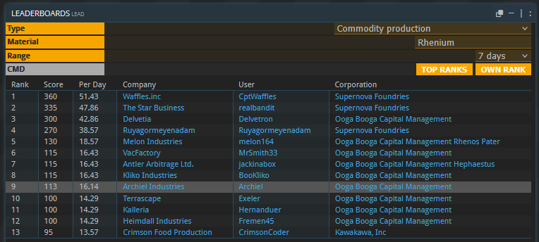
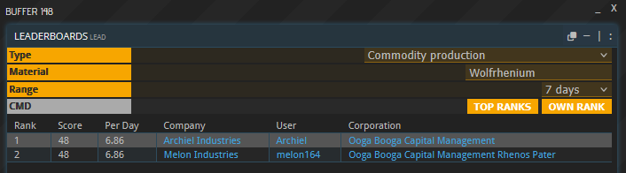

#### OOG Announces Dramatic Scaling of Rhenium Production on Rhenos Pater as Gateway Construction Era Nears

---

RHENOS PATER (BN-908b) – In a development described by OOG leadership as “the closest thing to a miracle you can achieve with nine bases, four thousand Pioneers, and a questionable safety budget,” the ongoing mining and refining operations on Rhenos Pater have entered full swing, delivering the first meaningful quantities of Rhenium metal in human history.

Over the past week, nine OOG members established a coordinated network of mining and refining installations across BN-908b’s rugged surface. Despite the planet’s well-documented hostility toward both equipment and optimism, the effort has already transformed the settlement into a bustling mining and smelting outpost.

Population counts reveal a staggering surge from 1,010 to 4,105 Pioneer workers, shattering all previous first-week growth records. Officials credit the influx to strong corporate recruitment, frontier enthusiasm, and the fact that several recruitment posters mistakenly implied Rhenos Pater had lovely beaches.

The first shipments of processed Rhenium have now been successfully transported back to the Antares core, where engineers have begun converting them into Wolfrhenium, a critical alloy used in advanced subspace stabilization technologies.

> “This is a historic milestone not just for OOG, but for all of Antares,” said OOG Blast Furnace Technician Melis Yora, carefully ignoring the stack of half-molten ores behind her. “With Wolfrhenium production underway, we anticipate completing our first Singularity Stabilizer (SST) within the week.”

Completion of the SST will mark the beginning of proper gateway construction in Antares space — a moment OOG executives have repeatedly described as “long overdue” and “totally not dependent on the whims of poorly understood cosmic forces.”

Meanwhile, several 5k/5k transport ships have already positioned themselves across key orbital vectors, prepared to begin ferrying additional gateway construction materials as early as tomorrow morning. Pilots have been instructed to expect heavy traffic, debris fields, and the usual flurry of excited scientists wandering across launch pads.

With operations accelerating, OOG expects Rhenos Pater to become a central pillar of Antares’ industrial future — assuming the Pioneers don’t unionize after discovering what Wolfrhenium is actually used for.

> OOG reminds all ambitious corporate leaders that [recruitment is open](/joining/), especially for those willing to ignore the phrase “unacceptable radiation exposure.”
