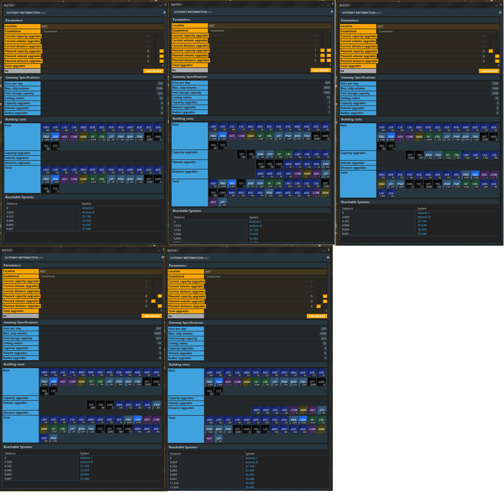
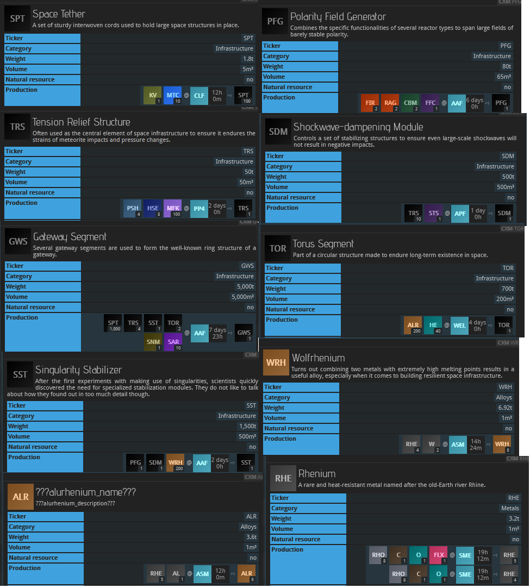
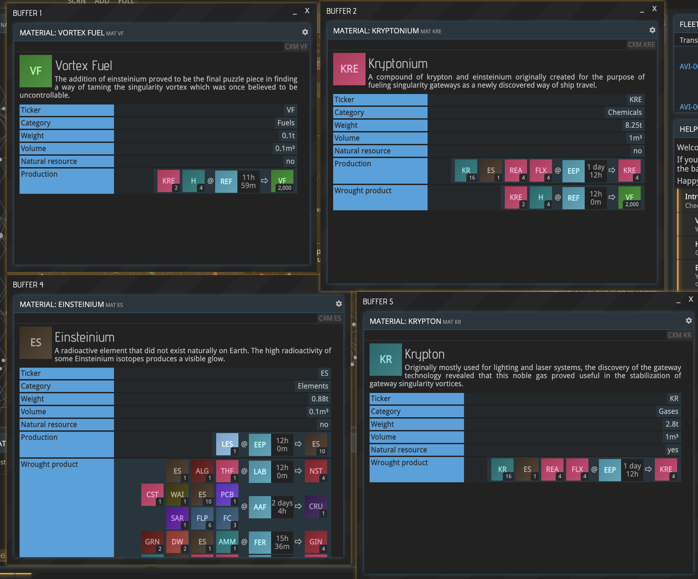
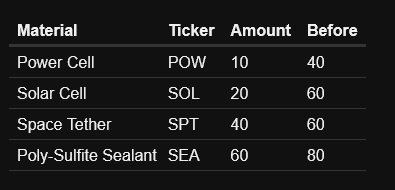



Gateways are coming, and Antares will be ready for them!

## Key Points We Know: 

### How they work:

* A planetary government can commission gateways in orbit. They administer those gateways.
* Ships jump from a source gateway to a destination gateway that is in range. 
* Gateways have limits on ships per day, distance the gateway can reach, the volume of ships that can fly through it, and the fuel that is used. 
* Gateways need to be refueled occasionally using Vortex Fuel, which is consumed by gateway usage.
* Each gateway is linked to one other gateway, in a symmetric 1:1 relationship.
* Ships without FTL drives can take gateways.

### Flying through gateways:

* Ships take time to travel through a gateway. Each gateway jump is "balanced to be of similar duration to an FTL jump".
* Ships take no damage through gateways.
* A short "ALIGN" phase is needed before starting the jump, once you are in the correct orbit.
* The flight buffer can take you through multiple gateways in a trip, if desired.
* You can see the tolls on the flight routing screen.

### How they are made:

* You can build multiple gateways in orbit of one planet.
* Governments can change the gateway destination with a motion.
* Gateways max out with 3 distance upgrades, and 5 upgrades total.

### The default gateway stats:

We have stats for gateways and their upgrades. Observations about these values:

* 200 jumps per day starting value- in my estimation this is a lot of jumps.
* 1500 max ship volume by default. This fits a starter ship (963 m3), a WCB (1488 m3), but not a standard 2k (2675m). One size upgrade allows all 2k ship configurations.
* Distance starts at 10 parsecs and with 3 upgrades goes to a max of 25 parsecs.

## How far is 25 Parsecs?

OOG has a [specially refitted version of Taiyi's map](https://oogcapitalmanagement.com/map/) that can calculate gateway distances. Since it's hard to visualize actual distances in any of the maps, tools are essential for pre-planning gateway routes.

I think the best metric of a good gateway is the number of jumps saved. Sometimes 20 parsecs can save quite a few jumps:



We have additional python tools that can brute force jump distances.

## Gateway cost

Costs have been well covered in discussion on discord. We now have a pretty solid look at the materials for each upgrade cost. It seems the two distance upgrades adds a few hundred of each afab and 240 LIT. We don't know the cost of the new materials, but since it doesn't add TSH/RSH/PSH, it's pretty cheap, proportionally. Here are some of the new materials:

Based on my work with the map distances, I think increased distance is a must-have upgrade. Every time you add 5 parsecs, you drastically increase the area under the gateway's circle, and the number of systems you could reach. 

Costs have been significantly analyzed by the community. See these calculations by Hernanduer.

Due to the high costs of a gateway, materials are also measured in Base-Area-Days. This is the amount of base area required to make the specified amount in one day. (so divide by 500 for a dedicated base). 





## Upkeep

Gateway upkeep was announced and [rebalanced in a recent dev post](https://com.prosperousuniverse.com/t/gateway-upkeep/6929/6?u=archiel). Currently, weekly upkeep is now:

This is probably something around 145k of items per week at current prices. We don't really know how fees will be collected, but we are hopeful this is tenable!

## Antares Gateway Planning

Te Antares Development Initiative is organizing gateway planning in the best region of space in the universe. It's important to consider both sides of a gateway in planning, the reusability of a gateway as a destination for multiple gateways, and the cost per jump saved, given the upgrades chosen.

