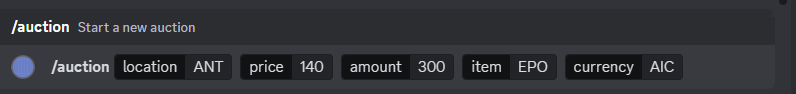
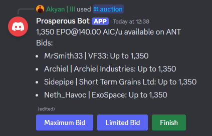
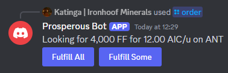
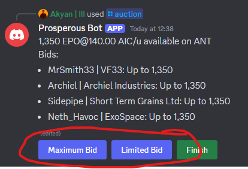
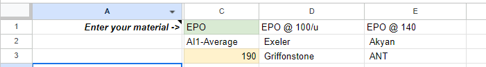
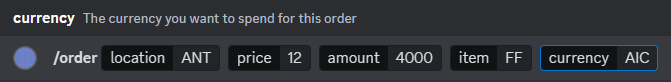
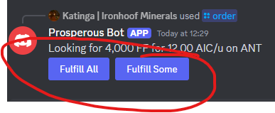
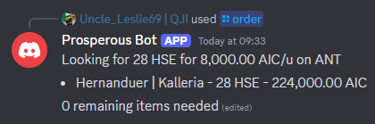
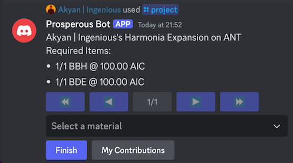

## Selling Goods

### Goods Auction

If you have stock you wish to sell then use the [#auction channel on discord](https://discordapp.com/channels/854795108720443393/1085624056562335755). You can use the /auction bot command to initiate a sale. The auction allows corp members to bid for a quantity of the stock you make available at the price you choose, when you finish the auction it’ll automatically split fairly the amount available amongst all those who’ve bid.

1. Open the [#auction channel](https://discordapp.com/channels/854795108720443393/1085624056562335755).
2. Type /auction and hit space
3. Enter the fields for the bot command
    1. Location - Where you wish the purchaser to collect the goods.
    2. Price
    3. Amount - The quantity of the good available for sale
    4. Item - The code for the goods. _For example, EPO for Epoxy Resin._
    5. Currency - e.g. AIC

	_It’ll look something like this:_ 

4. Hit enter. 
5. Your goods will then automatically be posted to the #auction channel for members to bid on.

_Once you have some bids, it will look like this:_

6. When you’re ready to complete the auction, at a time of your choosing, you can click the finish button. _The bot will then update the message to reflect who should receive the contracts_
7. Send the contracts to the successful bidders to receive the goods.
8. Fin.

### Fulfilling Orders

The members of the corp will post their own auctions in the #auctions channel, which you can choose to fulfil.

If you wish to sell any of your goods to them at the price & location they’ve specified, feel free to offer by clicking on the fulfil all, or fulfil some buttons on order messages posted by the bot.

The bot will then automatically update the order to state that you’re fulfilling some or all of the order. Once registered, feel free to send a contract to the other member, if not already sent by them.

## Buying Goods

### Bidding on Auctions

You can bid on goods offered by other players, for each auction posted by the bot you’ll see options to bid for the full amount of goods available, as well as a bidding for a subset of the goods:

Once you’ve clicked the buttons the auction message will automatically update. If there are bids for more goods than available, then upon finishing the auction, the bot will automatically calculate a fair distribution upon the bidding members. 

When you are bidding, the prices are set (they don’t increase as you bid). If you want a different price for a bid or an order, contact the person directly.

### Placing Orders

If you’d like to order goods from other members of the corporation the use the #orders channel on discord. You can use the /orders bot command to initiate a purchase. 

Before starting an order, check the [corp price sheet](https://docs.google.com/spreadsheets/d/1ElN228qfp6zBqv6srr_sXLwlicnvUcvJqCcA8dPWH-s/edit#gid=489658022) (or search through past auctions/orders) to see what kinds of prices corp members are offering. You'll often be able to place an internal corp order below the CX prices. You can quickly find the price for a material by entering the code in C1, and hitting enter. You’ll get results something like this:

To place a order:

1. Open the [orders channel](https://discordapp.com/channels/854795108720443393/1156955200867811450).
2. Type /order and hit space.
3. Enter the fields for the bot command
    1. Location - Where you wish the purchaser to collect the goods.
    2. Price
    3. Amount - The quantity of the good available for sale
    4. Item - The code for the goods. _For example, EPO for Epoxy Resin._
    5. Currency - e.g. AIC

_It’ll look something like this once you’re done:_

4. Hit enter
5. Your order will then automatically be posted to the #orders channel for members to bid on.  \
_It’ll look something like this:_

6. Await a member to offer to fulfil the order. Once they do it’ll change to look something like this:

7. _If a contract has not been sent by the fulfilling member._ Send a contract in-game to the person to match the order details in discord.

**Note:** If the person who fulfils your order adds the 🫵emoji, that means they would like you to send them the contract, rather than them creating it.

### Placing multi-product orders (projects)

If you want to order multiple types of products then you can use the /projects command in the #orders channel on discord. For example, if you need multiple construction materials for your next base expansion:

1. To place a project command you first need to construct a project string describing the goods that you require. The format is as follows, with each good separated by a comma: 
    
    `QuantityxMaterialTicker@PriceCurrency/u`

    For the earlier example the project string would look like the following:

    `1xBBH@100AIC/u,1xBDE@100AIC/u`

2. Open the channel to post your order (#orders, #orders-ships, #hq-upgrades)
3. Type /project and hit enter
4. Enter a name for your project. E.g. Harmonia Expansion
5. Enter your project string. e.g. 1xBBH@100AIC/u,1xBDE@100AIC/u
6. Enter the location for the pickup, most often ANT
7. Click submit.

Tip: If you leave the prompt open for too long it’ll timeout and result in an error when you click submit, so prepare the project string in advance!
