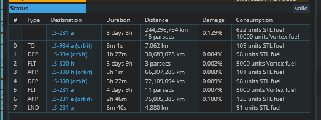
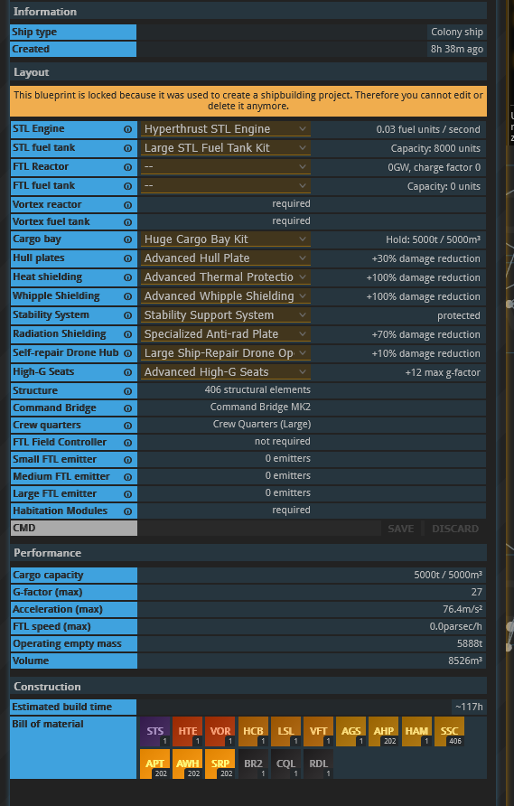
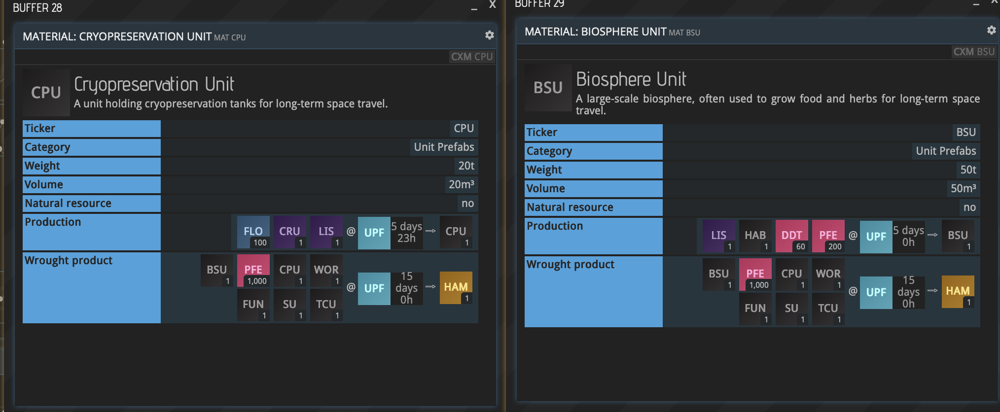
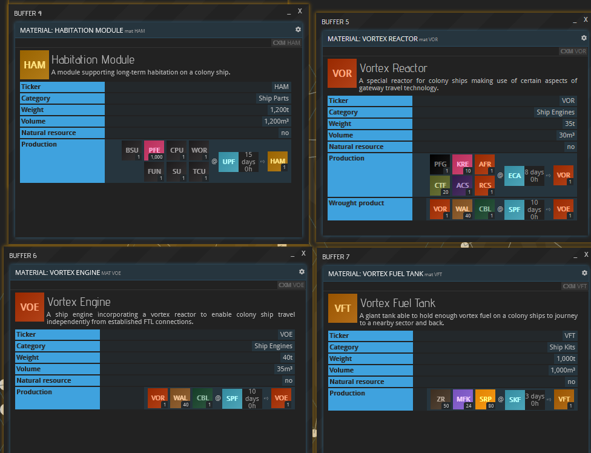
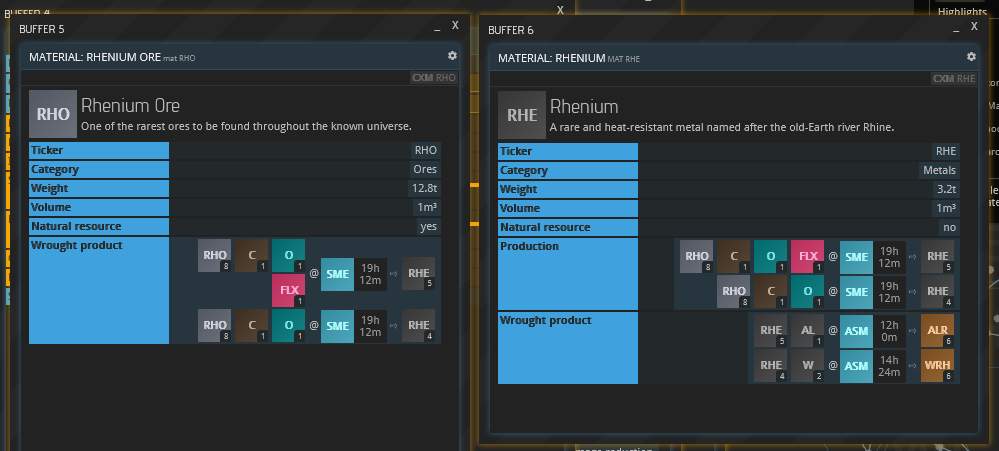
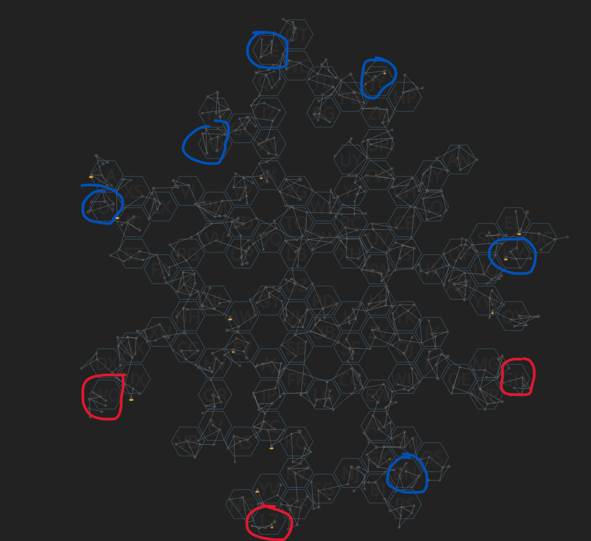

## A Tentative Big Picture Plan

A fleet of ships has been sent to AW-006e to establish 4 bases. This will secure our voting control over the planet, and establish a COGC and ADM. We will prep the population for KR extraction efforts. 

Someone will begin fuel production- out of corp OptimizedFunction will also be doing some fuel, but we'll probably want some internally too.

Next is the construction and assembly of a colony ship, which will be constructed in the shipyard on Nyx. 

The colony ship will jump to BN-908b, and lay down a series of extraction bases. (Each base gets 200 free PIO, plus we'll start with PIO immigration jobs immediately.)

If the colony ship can't jump from Nyx to BN-908b in one jump, we'll consider BN-299d as a staging planet, and add a shipyard there for some in-between travel. Then the colony ship will jump between Nyx and the RHO source.

Due to the size differences between RHO and RH, we will likely want to smelt the ore on AW-006e. So there's a ton of materials going back and forth. We will need a lot of volunteers with free permits!!

## Colony ship data

Colony ships will cost ~30m. They have an STL drive and a Vortex drive, but no FTL drive. They can jump without need for jump lanes. They seem to use a static 5000 VF per jump, and can jump up to about 12 parsecs. That's about the width of a map sector. But sometimes sectors are larger than that, so it's approximate guidance. It seems about 12 parsecs max.

## New Materials:

##  New Resource Locations:

On the test server, new resource deposits are live. Zoom in and look for the pie section. RHO is present in the new "void space" regions. 



Krypton gas is on these planets. We need KR before making colony ships, which we need before 



## New Region Data:

New "void space" regions have been added. They can only be accessed via colony ships (or eventually gateways).

### BN Sector:

The BN region is adjacent to Nyx, where we have a shipyard and 3 planets. BN also seems to contain the best RHO deposit.



### GH Sector:


### LZ Sector:


