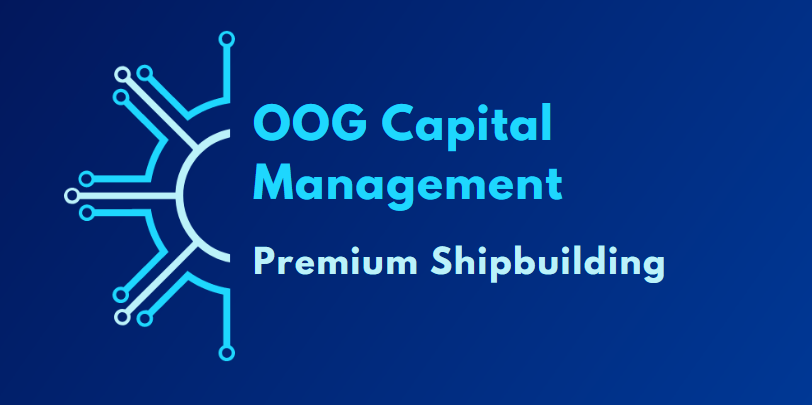

<h1>OOG Premium Shipbuilding</h1>


Due to a variety of ongoing issues, sales of OOG ships is now suspended, effective immediately.  This is due to a number of reasons:
* Very high internal and external demand for ships
* Internal changes to ship component production (old shipbuilders stopping, and getting new bases online)
* A rise in market prices, such that some of our ships are selling at a loss
* The ongoing political situation regarding Promitor

We will let you know when ship sales resume. We will have a slightly different model with different people handling the frontend vs. backend of ship sales, so I don't burn out so badly trying to manage it all.

My apologies to everyone who has requested a ship recently. We will not be able to fulfill them in a timely manner, and I will be closing / resetting the queue.
<!--
# Premium Shipbuilding

OOG Premium Shipbuilding offers a variety of ship designs with immediate availability on Hephaestus. We endeavor to have immediately-available ships and our site features a live-updating ship inventory! Every ship includes enough fuel to reach a CX- ready to build, ready to fly!

## Our Premium 2k LCB Ship

Although we offer a variety of ships, our core offering is our Premium 2k LCB ship:



* Fuel-Saving STL Engine uses half the fuel of a standard engine
* Quick-Charge FTL Reactor, a great balance of cost with 1/5th the charge time
* Medium STL and _Large_ FTL fuel tanks, for enhanced range
* Large Cargo bay, the 2k/2k offers the best balance for most needs
* Lightweight hull plates improve acceleration
* STS comes standard for immunity to gravitational damage- protect your entire fleet so you don't have to worry which ship is protected! 



## Instructions

Choose one of the listed blueprints and contact Akyan (preferably via Discord) for vetting. AIC is assumed and preferred. If you prefer another currency, please specify. Your sales contract will come from Archiel.  

Next, create a ship blueprint that matches your ship blueprint image. Rent 4 warehouses on Hephaestus to store the entire ship, or insert components into the ship as you accept the contracts. Make sure to click "start" in the shipyard after adding all the components.


-->



