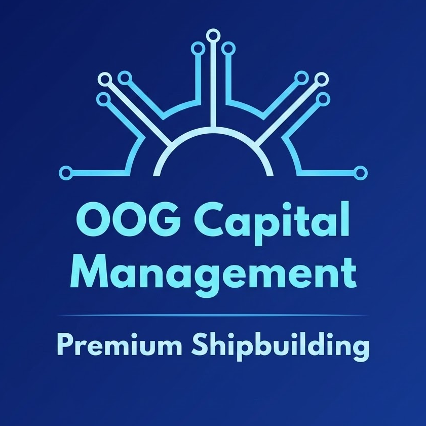

# OOG Premium Shipbuilding

OOG Premium Shipbuilding offers a variety of ship designs with immediate availability on Hephaestus. We endeavor to have immediately-available ships and our site features a live-updating ship inventory! Every ship includes enough fuel to reach a CX- ready to build, ready to fly!

## Instructions

Choose one of the listed blueprints and contact Akyan (preferably via Discord) for vetting. AIC is assumed, but please specify if you prefer another currency. Your sales contract will come from Archiel.  

Next, create a ship blueprint that matches your ship blueprint image. Rent 4 warehouses on Hephaestus to store the entire ship, or insert components into the ship as you accept the contracts. Make sure to click "start" in the shipyard after adding all the components.





