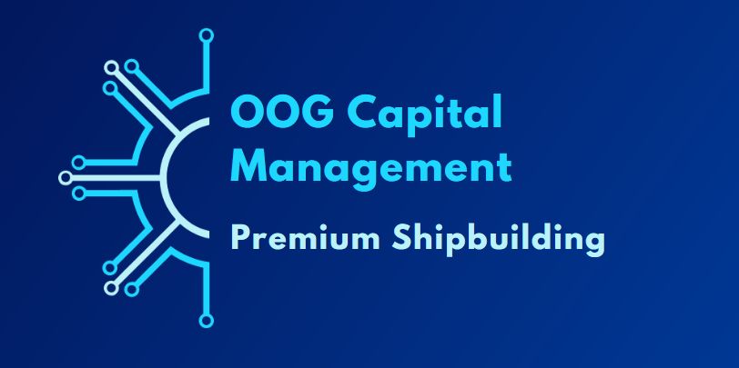

# Premium Shipbuilding

OOG Premium Shipbuilding offers a variety of ship designs with immediate availability on Hephaestus. There's no queue and we feature a live-updating ship inventory!

## Our Premium 2k LCB Ship

Although we offer a variety of ships, our core offering is our Premium 2k LCB ship:



* Fuel-Saving STL Engine uses half the fuel of a standard engine
* Quick-Charge FTL Reactor, a great balance of cost with 1/5th the charge time
* Medium STL and _Large_ FTL fuel tanks, for enhanced range
* Large Cargo bay, the 2k/2k offers the best balance for most needs
* Lightweight hull plates improve acceleration
* STS comes standard for immunity to gravitational damage- protect your entire fleet so you don't have to worry which ship is protected! 



## Instructions

Contact Archiel (preferably via Discord).  Create a ship blueprint that matches your ship blueprint image. Rent 4 warehouses on Hephaestus to store the entire ship, or insert components into the ship as you accept the contracts. Make sure to click "start" in the shipyard after adding all the components.





